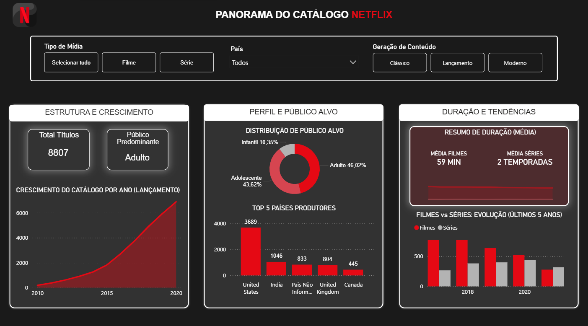

🎬 Netflix Data Engineering & Analytics
Este projeto engloba o pipeline completo de dados do catálogo da Netflix: desde a ingestão e tratamento pesado de dados brutos utilizando PySpark no Databricks (arquitetura Fato/Dimensão) até a criação de um dashboard interativo no Power BI.

📸 O Dashboard
()

🛠️ Tecnologias Utilizadas
 PySpark (Databricks): Limpeza de nulos, padronização de texto e normalização de tabelas na nuvem.
 Power BI: Modelagem dimensional (Star Schema), criação de medidas dinâmicas em DAX e desenvolvimento dos visuais.
 Git & GitHub: Controle de versão e documentação.

📂 Estrutura do Projeto
 ⁠/notebooks_script⁠: Scripts Python/PySpark desenvolvidos no Databricks.
 ⁠/relatorio_power-bi⁠: Arquivo original do projeto do Power BI (⁠.pbix⁠).
 ⁠/img⁠: Imagens da documentação.

🧼 Engenharia e Limpeza de Dados
 Toda a transformação complexa foi antecipada na camada de dados com PySpark para garantir performance e um modelo limpo no Power BI:
 Modelo Dimensional (Star Schema): Identificação e tratamento de dados multivalorados (como a coluna de países), utilizando a função ⁠explode⁠ para gerar uma tabela Dimensão de Países isolada e conectada à tabela Fato.
 Tratamento de Nulos: Higienização e substituição de dados ausentes.
 Padronização: Divisão de strings de duração em colunas numéricas de valor e unidade de medida.

📊 Principais Insights
 Filmes dominam a maior parte do catálogo da Netflix.
 A média de duração dos filmes é de 59 minutos, e a de séries é de duas temporadas (calculadas de forma 100% dinâmica).
 O catálogo possui maior foco no público adulto.
 Os Estados Unidos lideram isolados na produção dos títulos

💻 Exemplo de como a transformação foi estruturada para consumo no Power BI:

```PySpark

# Transformações das colunas

df_netflix_final = df_netflix_titulos \
 .withColumn("titulo", F.upper(F.trim(F.col("titulo")))) \
 .withColumn("tipo_midia", F.trim(F.when(F.col("tipo_midia") == "Movie", "Filme").when(F.col("tipo_midia") == "TV Show", "Série").otherwise("Tipo Mídia Não Informado"))) \
 .withColumn("diretor",F.trim(F.coalesce(F.col("diretor"), F.lit("Diretor Não Informado")))) \
 .withColumn("elenco",F.trim(F.coalesce(F.col("elenco"), F.lit("Elenco Não Informado")))) \
 .withColumn("data_adicao", 
        F.coalesce(
        F.to_date(F.trim(F.col("data_adicao")), "MMMM d, yyyy"),
        F.to_date(F.lit("1900-01-01"))
    )) \  -- outras transformações...
DISPLAY(df_netflix_final)